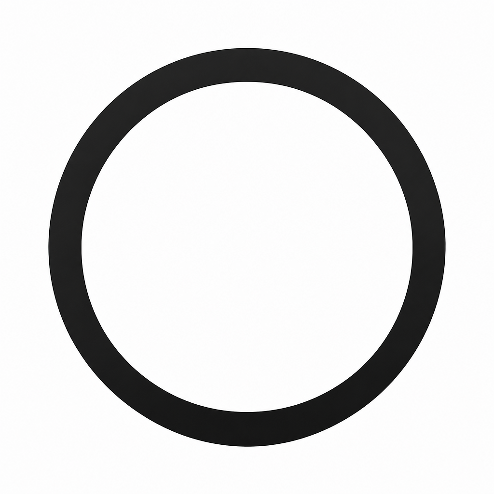

# Command Scheduler

An Electron tray app that runs shell commands on a cron schedule. Extracted from the Commands tab in [samsung-tv-control](https://github.com/timdevlet/samsung-tv-control).

Each command is a shell line (for example `node ~/scripts/backup.js`) that can run on a 5-field cron expression, or only when you press ▶. Runs go through your login shell, so your normal `PATH` applies. Closing the window hides it to the tray so schedules keep firing.

## Run

```bash
npm install
npm run electron:dev
```

Commands are stored in `scheduled-commands.json` (project root in development; the app data folder when packaged). Export / Import on the Commands tab uses the same file format.

## Scripts

| Command | What it does |
| --- | --- |
| `npm run electron:dev` | Dev app with hot-reload |
| `npm test` | Unit tests (scheduler, cron, runner) |
| `npm run typecheck` | TypeScript |
| `npm run electron:build` | Bundle into `dist-electron/` |
| `npm run dist` | Packaged installer via electron-builder |
